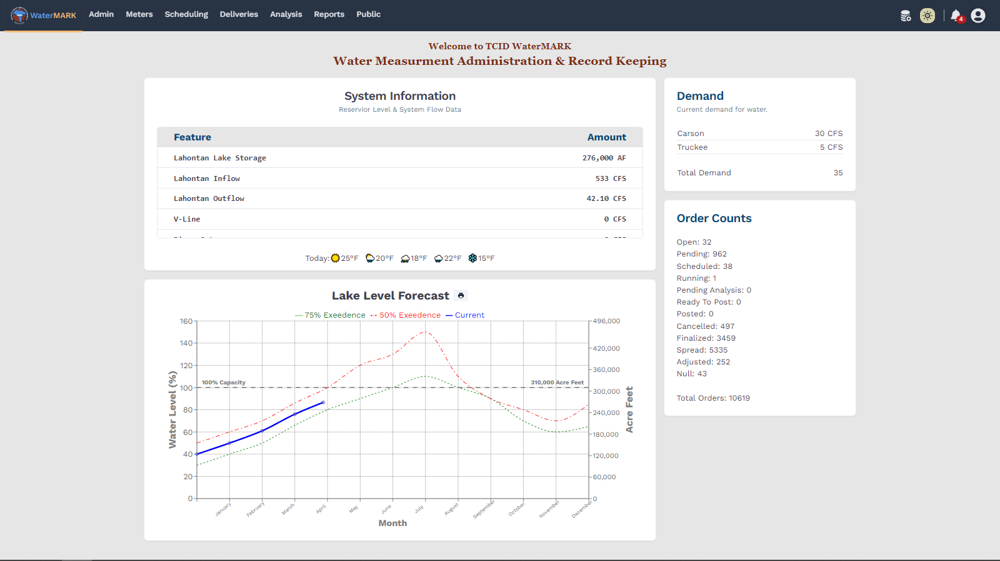
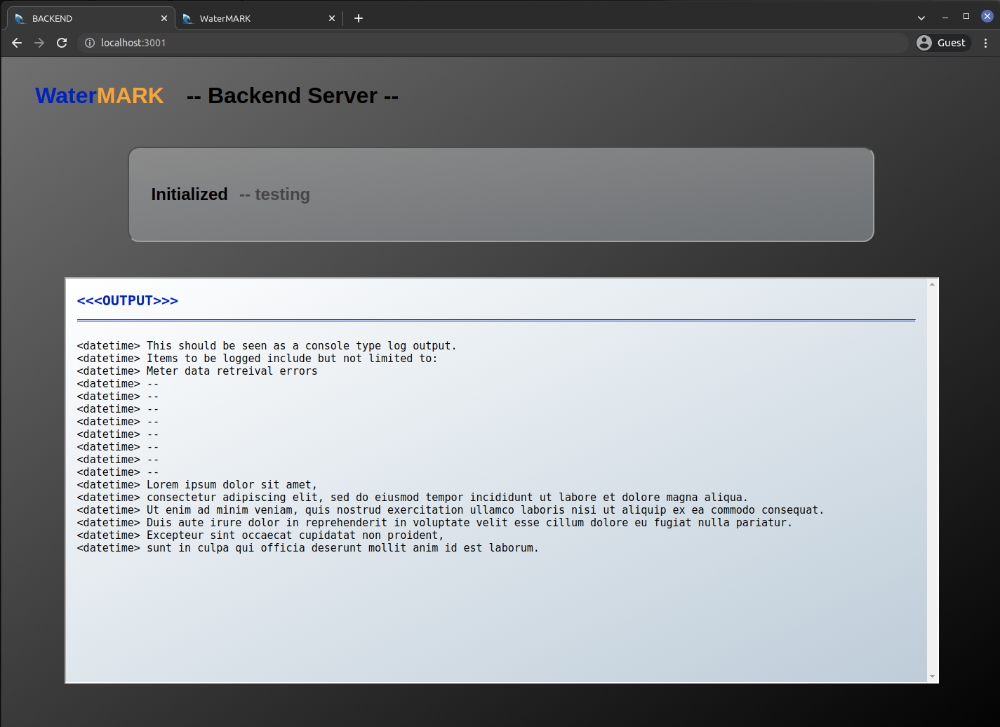

# WaterMARK
### _Water - Meter Access Repository Kit_
[](hhttps://img.shields.io)
___
#### Information

WaterMARK is a multi-source meter data aggregation and processing application.

___


### Build: Development

Example showing dev layout of frontend screen:


Example showing dev layout of backend screen:



___


## License

BSD 3-Clause License


## Dev Environment

Helpful commands:
```sh
npm start
npm run client
npm run server
```


