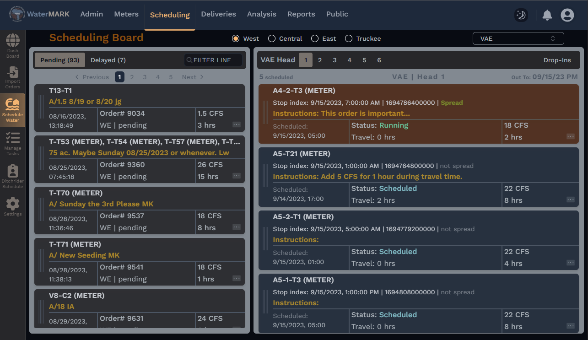
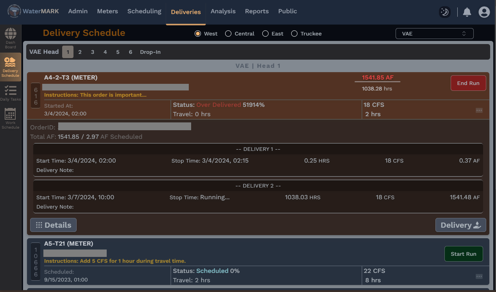

# WaterMARK

## _Water Measurement Administration & Record Keeping_

[](https://img.shields.io)


<!--  -->

[](https://github.com/mikelambson/WaterMARK/blob/main/LICENSE)
[](https://github.com/mikelambson/WaterMARK/issues)


[](https://ui.shadcn.com/)

[](https://www.npmjs.com/package/zustand)
[](https://ui.shadcn.com/)

___

### Information

Water Measurement Administration & Record Keeping => WaterMARK  
WaterMARK is a multi-source meter data aggregation, scheduling, task managemet and water order processing application.

This frontend system is designed to work with the [WaterMARK-backend](https://github.com/mikelambson/watermark-backend) as the primary API and data management tool.

___

### Build: Development

Example showing dev layout of frontend screen:






Example showing dev layout of backend screen:


___

## To-do

- get the scheduling module working
- deliveries module
- analysis module
- admin & posting module
- login and security features
- integrate vega graph interface for meters and analysis
- meters module
- reports module
- task system
- notification system
- integrate data sources
- public modules
- build backend data management modules

## License

[BSD 3-Clause License](./LICENSE)

## Dev Environment

This is a [Next.js](https://nextjs.org/) project bootstrapped with [`create-next-app`](https://github.com/vercel/next.js/tree/canary/packages/create-next-app).

Helpful scripts:

```sh
## Getting Started

First, run the development server:

npm run initialize

# dev
npm run dev
npm run git # for contribution
npm run count # do linecount for current branch

# staging and production
npm run build
npm start # add to process manager for deployment

```
